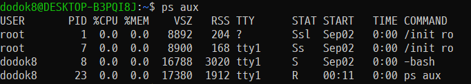

1. 다음 설명과 관계있는 명령으로 알맞은 것은?

    >  `/dev/hdb1`를 저널링 파일 시스템으로 만들고 I-node의 크기를 1MB로 지정한다.

    - 저널링 파일 시스템: 주 파일 시스템에 변경사항을 반영하기 전에 변경사항을 추적하여 저널에 저장하는 시스템. ext3와 ext4가 가장 자주 쓰인다.

    - I-Node: 정규파일, 디렉토리 등 파일시스템에 관한 정보를 저장하는 곳, 소유자 그룹, 접근 모드, 파일 형태, 아이노드 숫자등 해당 파일에 대한 정보를 저장한다.

    - [ ] `mkfs -t ext4 -i 1000 /dev/hdb1`:   mkfs의 `-i` 옵션은 bytes-per-inode를 지정한다.
    - [ ] `mkfs -t ext2 -T largeifle /deb/hdb1`: `-T largefile` 옵션이 존재하지 않는다.
    - [ ] `mke2fs -j -i 1000 /dev/hdb1`:  `-i` 는 bytes-per-inode를 지정한다. inode-size는 `-I`를 지정한다.
    - [x] `mke2fs -j -T largefile /deb/hdb1`: `-T`는 usage-type을 지정하며, 크기에 따라 I-node 크기를 다르게 지정한다. `news`는 4k, largefile은 1M, largefile4은 4M를 지정한다. 
    - 연관 명령어:
        - `mke2fs [options] 장치명`: ext2, ext3, ext4 파일 시스템을 만드는 명령, 최신 배포판에서 `mkfs` 명령시 실제로 사용되는 명령어 이다. 기본값은 ext2
        - `mkfs [-t fs_type] [option] 장치명`: root만 사용가능한 파일시스템 제작 명령어, 기본값은 ext2

2. 다음 특수권한 설정에 대한 설명으로 알맞은 것은?

    > /project 디렉터리에 Set-GID를 부여하여 파일 생성시 자동으로 그룹소유권을 지정하고, Sticky-Bit 권한을 설정한다.
    
    - 리눅스의 특수권한
    
        - `Set-UID`: 실행파일에 주로 사용됨, 해당 파일을 실행시, 실행시킨 사용자의 권한이 아닌 해당 파일 소유자의 권한으로 인식함. 설정하면 소유자 권한 부분의 x(실행권한) 자리에 s로 표기 되며, 실행 권한이 없는 파일에 부여하면 대문자 S로 나타난다.
        - `set-GID`: 파일에 설정되어 있을 경우, 해당 파일을 소유한 그룹 권한으로 인식한다. 이 디렉토리에 사용자들이 파일이나 디렉토리를 생성하면 사용자가 속한 그룹에 상관 없이 소유 권한 그룹으로 만들어 진다. 소유권 권한 표시에서 s로 나타나고, 실행권한이 없으면 S로 나타난다.
        - `Sticky-Bit`: 일종의 공유 디렉토리로 생성에는 제한이 없지만, 삭제는 본인이 아니면 불가능 하다. Group과 Other 계층 사용자에게 사용할 수 있으나 동시 사용은 불가능하다. other 계층 권한 부분의 x자리에 t로 표기되며, 실행권한이 없으면 T로 표현된다.
    
    - 연관 명령어
    
        - `ls -l [파일명]`: 소유권 정보를 볼 수 있다.
    
            ```bash
            dodok8@DESKTOP-B3PQI8J:/mnt/e/프로그래밍과 알고리즘/리눅스 마스터/2급$ ls -l 2018_4.md
            -rwxrwxrwx 1 dodok8 dodok8 2870 Jul 16 13:54 2018_4.md
            ```
    
            첫 부분은 허가권, 다음은 소유권을 가진 사용자, 그 다음은 그룹 소유권이다. 첫번 째 영역은 파일 타입, 그 다음은 3자리씩 끊어서 소유자에게 적용되는 권한, 두 번째는 해당 그룹에 속한 사용자들에게 적용되는 권한, 나머지는 다른 사람들(other)에 적용되는 권한이다. r은 읽기 w는 쓰기 x는 실행(디렉토리의 경우 디렉토리에 접근할 수 있는 권한)을 의미한다.
    
        - `chmod`: 파일이나 디렉토리에 접근할 수 있는 허가권을 설정한다. 문자모드와 숫자 모드가 있다.
    
            - 문자모드 : rwx로 표기하며, 사용자 지정은 u,g,o,a로 표기한다.(a는 all) = 기호는 기존 권한에 덮어 쓰기, -는 권한 해제, +는 기존 권한에 더하기 이다.
    
                ```bash
                chmod ugo+rwx aa.txt
                chmod a+rwx aa.txt
                // 모든 사용자에게 모든 권한을 주는 같은 명령어
                ```
    
            - 숫자 모드: 일의 자리는 other, 그룹은 십의자리, 백의 자리는 소유자로 지정하며, 읽기권한은 4, 쓰기 권한은 2, 실행권한은 1, 권환 없음은 0으로 이를 엮여서 표현한다.
    
                ```bash
                chmod 777 aa.txt
                // 위와 같다
                ```
    
            - 특수 권한: `Set-UID`, `Set-GID`의 경우, 문자모드는 s를 사용하고, `Sticky-bit`는 t를 사용한다. 숫자 모드의 경우 천의 자리에 각각 4,2,1,을 사용한다.
    
    
    - [x] `chmod g+s,o+t /project` : g+s로 set-GID 부여, o+t로 Sticky-Bit
    
3. 다음 중 리눅스 파일 시스템에 대한 설명으로 틀린 것은?

    - [ ] Reiserfs, XFS, JFS는 저널링 파일 시스템이다.
    - [x] sysv는 리눅스에서 사용하는 가상 파일 시스템이다: 가상 파일 시스템 구현이 아닌 SystemV/Coherent 파일 시스템의 구현이다.
    - [ ] iso9660은 DVD를 마운트 할 때 지정하는 파일 시스템이다.
    - [ ] nfs는 네트워크 상의 시스템 파일을 공유할 때 사용하는 파일 시스템이다.
    
4. 다음 중 운영 중인 리눅스 서버의 파일 시스템에 손상된 디렉토리나 파일을 수정할 때 사용하는 명령으로 알맞은 것은?

    - [ ] `mkfs`: 파일 시스템 할당
    - [ ] `fsck`: filesystem check, 리눅스 파일 시스템을 검사하고 수리하는 명령어이다. e2fsck를 사용할 때 실제 실행되는 명령어이다.
    - [ ] `chkdsk`: DOS 계열에서 손상된 디렉토리나 파일 수정
    - [ ] `scandisk`: DOS 계열에서 하드드라이브의 파일 시스템과 불량 점검

5. 다음 중 fdisk 명령어에 대한 설명으로 틀린 것은?

    - 연관 명령어
        - `fdisk`: 디스크 파티션을 확인하고 추가/삭제하는 명령어, 재부팅이 필수적이다.
            - p : 현재 디스크 정보 출력
            - d : 파티션 삭제
            - n : 파티션 새로 생성
            - t : 파티션 속성 변경, 82(swap), 83(Linux), 8e(Linux LVM), fd(Raid)
            - w: 변경된 파티션의 정보를 저장하고 종료
            - q: 변경된 파티션의 정보를 저장하지 않고 종료
            - m: 커맨드 목록

    - [ ] 설정 후에는 partition table 업데이트가 필요하다
    - [x] 파티션을 삭제하는 특정 명령어는 d이다.
    - [ ] 파티션을 추가하는 특정 명령어는 w이다.
    - [ ] 파티션 정보를 확인할 수 있다.

6. 다음 ( 괄호 ) 안에 들어갈 명령으로 알맞은 것은?

    ```bash
    ls -l lin.txt
    -rwxrwxrwx. joon ihd 513 Dec 22 21:05 lin.txt
    ( 괄호 )
    ls -l lin.txt
    -rwsrwsrws. joon kait 513 Dec 22 21:05 lin.txt
    ```

    - [ ] `usermod kait lin.txt`: `usermod` 는 계정관리에 사용되는 명령어
    - [ ] `groupmod kait lin.txt`: `groupmod`는 그룹 관리에 사용되는 명령어
    - [ ] `chown kait lin.txt`: 파일의 소유자와 그룹을 변경하는 데 사용됨, 올바른 답은 `chown :kait lin.txt`
    - [x] `chgrp kait lin.txt`

7. 다음 설명에 해당하는 허가권을 설정하는 명령으로 알맞은 것은?

    > list.txt. 파일에 대하여 모든 사용자 및 그룹에게 모든 권한을 준다.

    - [x] `chmod a=rwx list.txt`: `chmd 777 list.txt`랑 같다.

8. 다음 중 파일이나 디렉토리의 소유권 및 그룹 소유권을 변경하는 명령으로 알맞은 것은?

    - [ ] `chmod`:권한 설정
    - [x] `chown`:소유권 설정
    - [ ] `chgrp`:그룹 변경
    - [ ] `unmask`: 파일이나 디렉토리 생성 시 부여되는 기본 허가권 값 지정

9. 사용자나 그룹에 쿼터를 설정할 때 사용하는 명령어로 알맞은 것은?

    쿼터: 사용자나 그룹 별로 디스크 사용량과 생성할 수 있는 파일 갯수 제한

    - [ ] `quota`: 사용자 단위로 쿼터 설정 정보 보여주기
    - [x] `edquoata`: 쿼터 설정(vi 편집기로)
    - [ ] `repquota`: 파일 시스템 단위로 쿼터 정보 보여주기
    - [ ] `quotaon`: 쿼터 제한 활성화, 반대는 `quotaoff`

10. 다음 디렉터리에 대한 설명으로 틀린 것은?

    ```bash
    [root@ihd ~]# ls -ld /tmp
    drwxrwxrwt. 10 root root 4096 2018-04-18 18:04 /tmp
    ```

    - [ ] 특수권한 중 Sticky-Bit가 설정되어 있다.
    - [ ] tmp 디렉터리의 소유권은 root 사용자에게 있다.
    - [x] 모든 사용자에게 모든 권한이 주어진 디렉토리이다.: Sticky-Bit가 있으므로 삭제는 마음대로 안됨.
    - [ ] 시적으로 필요한 시스템이나 응용프로그램에 필요한 파일들이 저장되는 디렉토리이다.

11. 다음 ( 괄호 ) 안에 들어갈 내용으로 알맞은 것은?

     ```bash
     echo ( 괄호 )
     ko_KR.UTF-8
     ```

     - 환경변수: 사용할 때(정확히는 쉘에서 변수 샤용할 때) \$를 붙이자.

     - [x] `$LANG`
     - [ ] `LANG`
     - [ ] `$TERM`: 터미널 종류 출력
     - [ ] `TERM`

12. 다음에서 설명하는 셸(Shell)의 종류로 맞는 것은?

     > - 1989년 브라이언 폭스가 GNU 프로젝트를 위해 개발한 셸
     > - 명령 히스토리, 명령어 완성 기능, 히스토리 치환, 명령행 편집 등을 지원
     > - 본 셸을 기반으로 하여 제작

     - [ ] `csh`: 1978년, C 셸
     - [ ] `ksh`: 1983년, 콘 셸
     - [ ] `tcsh`: 2016년, C 셸 기반, TENEX C 셸
     - [x] `bash`

13. 다음 중 배시셸에서 현재 작업 디렉토리를 알려주는 환경변수로 알맞은 것은?

     - [ ] `PS1`: 프롬프트 변수 ([`PS2`와 차이](https://jhnyang.tistory.com/58))
     - [x] `PWD`: Print Working Directory
     - [ ] `PATH`: 실행파일을 찾는 디렉토리 경로
     - [ ] `SHELL`: 사용자의 로그인 쉘

14. 다음 중 기존의 PATH에 /home/ihd 경로를 추가하려고 할 때 알맞은 것은?

     - 관련 명령어:
         - `export`: 셸 변수를 환경 변수로 변경해주는 명령어
         - `set`: 셸 변수를 관리하는 명령어
         - `env`: 환경변수를 보여주거나, 설정 혹은 삭제

     이 문제의 경우 export를 사용해야 하므로 쉘 변수를 설정(변수명=데이터 값)하고 환경 변수를 설정한다.

     - [x] `export PATH=$PATH:/home/ihd`: 띄어쓰기 = 주변에 넣으면 안됨

15. history 명령어를 이용해 사용자가 입력한 명령어를 확인하려고 한다. 다음 중 히스토리 목록 중에서 5번째에 사용한 명령을 실행하는 것으로 알맞은 것은?

     - 관련 명령어:
         - `history [인수값]`: 사용자가 입력한 명령어를 확인하는 명령어
         - `!`: Bash bang 이라 한다.

     - [ ] `!!`: 직전 명령어 재실행
     - [ ] `!5`: 히스토리 목록에서 5번째 실행
     - [ ] `history 5`: 최근 5개 명령어 보여줌
     - [ ] `history !5`: numeric 필요하다며 실행이 안됨

16. 다음 중 가장 먼저 개발된 셸로 알맞은 것은?

     - [ ] C shell
     - [ ] Bash Sehll
     - [ ] Korn Shell
     - [x] Bourne Shell

17. 다음 중 설정된 전체 환경 변수값을 확인하는 명령으로 알맞은 것은?

     - [x] `env`: 이거임
     - [ ] `alia`: 명령어를 묶어서 단축으로
     - [ ] `echo`: 문자열과 셸 변수및 환경 변수 출력
     - [ ] `export`: 셸 변수를 환경변수로

18. 다음 중 배시셸(Bash Shell)에서 사용자가 입력한 명령어를 확인하는 키로 알맞은 것은?

     - [x] 위/아래 방향키

19. 프로세스 우선순위에 관련된 설명으로 알맞은 것은?

     - [x] `nice`, `renice`, `top`은 프로세스 우선순위를 변경할 수 있는 명령이다.
     - [ ] NI값의 기본 값은 0이고, 지정 가능한 값의 범위는 -19~20이다.: -20~19사이로 지정가능하다.
     - [ ] 일반 사용자는 NI값 감소만 가능하고 root사용자만 NI값을 증가시킬 수 있다.: root사용자만 낮출 수 있고, 일반 사용자는 감소만 가능하다.
     - [ ] NI값을 설정하면 리눅스는 상황에 따라 PNI값을 변경하여 우선순위를 조절한다.: 리눅스 운영체제는 PRI값만 변경가능하다.

20. 다음 설명에 해당하는 명령으로 알맞은 것은?

     - 연관 명령어
         - `nice`: 프로세스 명을 기반으로 프로세스 순위를 바꿔 줄 수 있음
         - `renice`: PID 기반으로 프로세스 순위를 바꿔줄 수 있음
         - `top`: 시스템의 상태를 전반적으로 가장 빠르게 파악 가능(CPU, Memory, Process)
    
    - [x] `renice -10 1416164`
    
21. 다음 중 `ps aux` 명령으로 출력되는 것으로 알맞은 것은?

     - 연관 명령어

         - `ps aux`: 모든 프로세스를 소유자 정보와 함께 표시한다.

             

     - [ ] UID
    
     - [x] RSS
    
     - [ ] PPID
    
     - [ ] STIME
    
22. 다음 중 `CTRL`+`C` 입력 시 보내지는 시그널로 알맞은 것은?

     - [ ] SIGHUP: 종료, 행업(Hangup, 아무런 반응을 하지 않은 상태로써 시스템 운영이 불가능한 상태)
     - [x] SIGINT:  종료, 터미널 인터럽트 신호
     - [ ] SIGQUIT: 종료, 터미널 종료 신호, `CTRL`+`\`
     - [ ] SIGKILL: 종료, 킬(신호를 잡거나 무시할 수 없음)
    
23. 다음 ( 괄호 ) 안에 들어갈 내용으로 알맞은 것은?

     > 다수의 작업이 백그라운드(Background)로 수행 중인 경우 ( ㉠ ) 명령으로 작업내용을 확인한 후 ( ㉡ ) 명령으로 포어그라운드(Foreground) 프로세스로 전화시킬 수 있다.

     - 연관 명령어
         - `jobs`: 작업이 중지된 상태, 백그라운드로 진행 중인 직업 상태 표시
         - `ps -l`: 동작 중인 프로세스를 보여주는 원래 명령에, 프로세스 정보를 길게 보여주는 옵션, 우선순위와 관련된 PRI와 NI 값을 확인할 수 있다.
         - `fg`: 백그라운드에서 실행중인 명령어를 포그라운드로 전환

     - [ ] ㉠ `jobs` ㉡ `fg PID`
     - [ ] ㉠ `ps -l` ㉡ `fg PID`
     - [x] ㉠ `jobs` ㉡ `fg %작업번호` 
     - [ ] ㉠ `ps -l` ㉡ `fg %작업번호`

24. 다음 중 특정 사용자의 crontab 내용을 작성할 때 사용하는 명령으로 알맞은 것은?

     - 연관 개념 및 명령어
         - `cron`: 유닉스 계열 컴퓨터 운영체제의 시간 기반 잡 스케쥴러이다. 시스템 운영에 필요한 작업은 `/etc/crontab`에 등록해서, 사용자 필요에 의한 작업은 `crontab`이라는 명령을 수행해서 등록할 수 있다.
         - crontab 파일의 구성: minute hour day_of_month month day_of_week user-name command 로 이루어져 있다. user-name은 일반적으로 생략한다.
         - `crontab`: `-l`(list, 설정된 내용 출력), `-e`(edit, 내용 작성 및 수정), `-r`(remove, 내용 삭제), -u (특정 사용자의 user파일 조작)

     - [x] `crontab -e -u ihduser`

25. 다음 중 `nohup` 명령어에 관한 설명으로 틀린 것은?

     - 연관 개념 및 명령어
         - `nohup`: 사용자가 로그아웃하거나 작업 중인 터미널 창이 닫혀도 실행 중인 프로세스를 백그라운드 프로세스로 작업될 수 있도록 해주는 명령이다. 사용자가 명령행 뒤에 `&`를 명시해야 한다.
 - [ ] 표존출력과 표준에러는 `nohup.out` 파일을 생성해 기록한다.
     - [x] nohup는 실행한 명령을 자동으로 백그라운드로 보내 작업한다.
     - [ ] 쓰기 작업이 불가능한 경우 `$HOME/nohup.out` 파일을 생성해 기록한다.
     - [ ] 작업 중인 터미널창이 닫혀도 실행중인 프로세스를 백그라운드를 작업할 수 있게 한다.

26. 다음 중 프로세스(Process)에 관한 설명으로 알맞은 것은?

     - [ ] 최초의 프로세스인 init 프로세스는 PID가 0이다. : 0이 아니라 1이다.
     - [ ] 보통 명령어를 수행하면 exec 방식으로 실행된다. : fork 방식(새로운 메모리를 할당받아 복사본을 실행)으로 실행된다. exec는 덮어쓰는 방식이다.
     - [x] pstree 명령으로 init 프로세스가 모든 프로세스의 부모 프로세스임을 확인 할 수 있다.
     - [ ] 작업 중인 터미널창이 닫혀도 실행중인 프로세스를 백그라운드로 작업할 수 있게 한다. : 당연히 아님

27. 다음 설명으로 알맞은 것은?

     - [ ] PID
     - [ ] SIGNAL
     - [ ] DAEMON
     - [ ] PROCESS

28. 다음 그림에서 알 수 있는 설명으로 틀린 것은?

     ```bash
     [root@ihd ~]$ find / -name '*.txt' > list.txt &
     [1] 12677
     ```

     - [ ] 작업번호는 1이다.
     - [ ] PID는 12677이다.
     - [x] PPID는 12676이다. : PPID는 알 수 없다.
     - [ ] 백그라운드 프로세스 실행 방법이다.

29. 다음은 vi 편집기 실행 시 자동으로 행번호가 나타나도록 설정한 후에 확인하는 과정이다. ( 괄호 ) 안에 들어 갈 내용으로 알맞은 것은?

     ```bash
     [ihduser@www ~]$ vi ( ㉠ )
     [ihduser@www ~]$ cat ( ㉠ )
     ( ㉡ )
     ```

     - 연관 개념
         - vi 설정법: `.exrc`에 저장하고 : 붙이지 않고 쓴다. `vim`은 `.vimrc`에 저장한다. `set number` 이라 적어도 라인 넘버가 나온다.

     - [ ] ㉠ .virc ㉡ set nu
     - [ ] ㉠ .virc ㉡ :set nu
     - [x] ㉠ .exrc ㉡ set nu
     - [ ] ㉠ .exrc ㉡ :set nu

30. 다음 중 LISP 언어를 사용하려는 프로그래머에게 가장 최적화된 편집기로 알맞은 것은?

     - [ ] vi
     - [ ] pico
     - [ ] vim
     - [ ] emacs : 자체적인 LISP 방언인 emacs LISP를 내장하고 이를 기반한 확장기능을 가지고 있는 등 LISP 개발자에게 유리한 것이 많다.

31. vi 편집기에서 바로 직전에 실행한 줄 삭제 명령을 취소하여 복원하려고 할 때 사용하는 명령으로 알맞은 것은?

    - [x] u
    - [ ] x : 커서가 위치한 곳 글자 5개 삭제
    - [ ] y : ??????
    - [ ] z : ??????

32. 다음의 작업을 원격지 서버에 접속하여 사용하던 중 네트워크가 차단되면서 비정상적으로 종료되었다. 이 때 생성되는 파일로 알맞은 것은?

    ```bash
     [ihduser@www ~]$ vi lin.txt
    ```

    - 연관 개념
        - swp 파일: vi 사용 중 강제종료가 발생할 경우 생기는 파일. 복구를 선택하거나, 수정하기에서 :recover 커맨드, `vi -r lin.txt` 로 수정할 수 있다.

    - [x] .lin.txt.swp

33. 다음 중 X 윈도우 환경에서만 사용 가능한 편집기로 틀린 것은?

    - [ ] gedit
    - [x] nano
    - [ ] xemacs
    - [ ] gvim

34. 다음 설명에 해당하는 편집기로 알맞은 것은?

    > GNOME 기반의 문서 편집기로 용량은 작지만, 다양하고 강력한 기능을 제공한다.

    - [ ] nano
    - [ ] pico
    - [ ] gedit
    - [ ] emacs

35. 다음 중 압축과 압축해제 명령어의 조합으로 틀린 것은?

    - [ ] xz, unxz
    - [ ] gzip, gunzip
    - [x] bzip2, unzip2: unzip2가 아니라 bzip2이다.
    - [ ] compress, uncompress

36. 다음 중 리눅스에서 소스(Source)프로그램을 설치하기 위한 도구로 거리가 먼 것은?

    - [ ] tar: 소스파일 압축해제
    - [ ] gcc: 컴파일
    - [x] rpm: 소스 프로그램이 아닌 패키지 관리자이다.
    - [ ] make

37. 다음중 tar의 특징으로 틀린 것은?

    - [ ] 테이프 관련 장치를 이용하여 백업할 때 사용할 수 있게 된다.: 원래는 tape archive를 위한 명령이었다.
    - [ ] 심볼릭 링크가 기리키고 있는 원본 파일을 저장하는 기능을 제공한다.
    - [ ] 디렉터리를 지정하면 그 디렉터리의 모든 파일과 서브 디렉터리들까지 함께 묶여진다.
    - [x] GNU tar는 파일로 묶거나 풀어주는 기능만 제공하고, 유닉스 tar는 압축 관련 직업도 지원한다.

38. 다음은 tar 명령을 이용해 압축을 해제하는 명령이다. ( 괄호 ) 안에 들어갈 내용으로 가장 알맞은 것은?

    ```bash
    tar ( 괄호 ) httpd-2.4.34.tar.bz2
    ```

    - 연관 명령어 및 개념
        - `tar`: [이곳](https://recipes4dev.tistory.com/146) 참조
- [ ] xvf : tar 파일의 압축을 해제한다.(`-x`), 현재 어떤 파일을 작업 중인지 보여주며(`-v`), 파일이름을 뒤에 지정해서(`-f`)
    - [ ] jxvf : bz2형식의 파일을 다룬다.(`-j`)
    - [ ] Jxvf : xz 관련 명령어(`-J`)
    - [ ] zxvf : gz 관련 명령어(`-z`)
    
39. `rpm` 명령어로 패키지를 삭제 하려고 한다. 다음 중 의존성이 있는 패키지가 존재할 경우에도 제거하는 옵션으로 알맞은 것은?

    - 연관 명령어
        - `rpm` : Red Hat Package Manager, 설치는 `-i`, 삭제는 `-e`, 업그레이드는 `-U`, 쿼리모드는 `-q`로 접근한다.

    - [ ] `-e`: 삭제 모드로 사용하는 옵션
    - [ ] `--test`: 실제 실행은 안하는 테스트 모드
    - [ ] `--force`: 강제 설치/삭제
    - [ ] `--nodeps`: 의존성 검사 생략

40. 다음 중 `tar` 명령이 지원하는 압축형식으로 틀린 것은?

    - [ ] `xz` : `-j`
    - [x] `zip`
    - [ ] `gzip` : `-z`
    - [ ] `compress` : `-Z`

41. 다음 중 `dpkg` 명령어를 이용해 환경 설정파일은 남기고 패키지를 삭제하는 옵션으로 알맞은 것은?

    - 연관 명령어
        - `dpkg` :  데비안 패키지 관리 시스템의 기초가 되는 소프트웨어

    - [ ] `-e` : 제어스크립트 추출
    - [x] `-r`
    - [ ] `-P` : 환경설정까지 전부 제거(purge)
    - [ ] `-R` : 디렉토리 명을 이용해 제거

42. 다음 중 .rpm 형태의 파일로 배포된느 rpm 파일의 구성요소로 틀린 것은?

    - [ ] 버전
    - [ ] 릴리즈
    - [ ] 압축형식
    - [ ] 패키지 이름

43. 다음 ( 괄호 ) 안에 들어갈 내용으로 알맞은 것은?

    > 프린터 큐(Queue) 관련 내용을 출력해주는 BSD 계열 명령어는 ( ㉠ ) 이고, System V 계열 명령어는 ( ㉡ ) 이다.

    - 연관 개념 및 명령어
        - `lpq`
    - [x] ㉠ lpq ㉡ lpstat
    - [ ] ㉠ lpq ㉡ lpr
    - [ ] ㉠ lp ㉡ lpstat
    - [ ] ㉠ lp ㉡ lpr

44. 다음 설명으로 알맞은 것은?

    > 프틴터 큐(Queue)에 대기 중인 작업을 삭제하는 명령으로 취소할 프린트 작업 번호를 명시한다. 작업 번호를 명시하지 않을 경우 가장 마지막에 요청한 작업을 취소한다.

    - [ ] `lpq`: 프린터 큐의 작업 목록 출력
    - [ ] `lpr`: 프린터 작업을 요청하는 명령어
    - [x] `lprm`
    - [ ] `cancel`: 프린트 작업을 취소하는 명령어, System V용이며 요청 ID를 확인해야 한다

45. 다음 중 USB 스캐너 관련 파일을 찾아주는 명령어로 알맞은 것은?

    - [ ] `alsactl`
    - [ ] `scanimage`
    - [ ] `sane-find-scanner`
    - [ ] `system-config-scanner`

46. 다음 중 리눅스 시스템 USB 포트에 프린터를 직접 연결 하는 경우 생성되는 관련 파일로 알맞은 것은?

    - [x] /dev/usb/lp0

47. 다음 중 표준 유닉스 장치 시스템 콜(POSIX READ, WRITE, IOCTL 등)에 기반을 둔 OSS에 대한 설명으로 알맞은 것은?

    - 연관 개념 및 명령어
        - OSS: 오픈 사운드 시스템(Open Sound System, OSS)은 유닉스 및 유닉스 계열 운영 체제의 사운드를 만들고 캡처하는 인터페이스, ALSA로 대체됨
    - [ ] 애플이 개발한 오픈소스 프린팅 시스템이다. : CUPS
    - [ ] 리눅스에서 프린터를 지원해주는 초기 인쇄 시스템이다. : LPRng
    - [ ] 스캐너, 디지털카메라 등 이미지 관련 하드웨어를 제어하는 오픈소스 시스템이다. : SANE
    - [x] 유닉스계열 운영체제에서 사운드를 만들고 캡처하는 인터페이스이다.

48. 다음 설명으로 알맞은 것은?

    - [ ] ALSA
    - [ ] OSS
    - [x] CUPS
    - [ ] LPRng

49. 다음 중 ( 괄호 ) 안에 들어갈 내용으로 알맞은 것은?

    > X 윈도는 X 서버와 X 클라이언트가 독립적으로 동작하는 네트워크 지향 시스템이기 때문에 원격지의 X 클라이언트를 다른 시스템의 X  서버에서 실행시킬 수 있다. X 서버에서 원격지의 X클라이언트를 실행하기 위해서는 접근을 허가해야 하는 데 이 때 IP 주소 기반으로 접근을 허가하는 명령이 ( ㉠ ) 이다. 또한 X 클라이언트에서 원격지의 X 서버에 프로그램이 전달되기 위해서는 실행되는 터미널이 정의되어 있는 환경변수인  ( ㉡ ) 을 수정해야 한다.

    - 연관 개념 및 명령어
        - `xhost [+|-] [IP 주소 및 도메인]`: X 서버에 접속할 수 있는 클라이언트를 지정/해제 한다.
        - xauth는 뭐지?
    - [ ] ㉠ xhost ㉡ TERMINAL
    - [ ] ㉠ xhost ㉡ DISPLAY
    - [ ] ㉠ xauth ㉡ DISPLAY
    - [ ] ㉠ xauth ㉡ TERMINAL
    
50. 다음 중 GNOME에 대한 설명으로 틀린 것은?

    - [x] Qt 라이브러리를 사용하여 개발되었다.
    - [ ] GNU 프로젝트를 통해 만들어졌다.
    - [ ] 응용프로그램은 GPL 라이센스를 ㄸ따른다.
    - [ ] 재사용이 쉽도록 소스코드를 공개하였다.

51. 다음 중 256 color 모드로 X 윈도를 실행시키는 명령으로 알맞은 것은?

    - 연관 개념 및 명령어
        - 2^8 = 256, 따라서 8비트가 256개 색상이다.
        - startx : X 윈도를 실행하는 명령어
    - [x] `startx -- -depth 8`

52. 다음 설명하는 내용으로 알맞은 것은?

    > 이 것은 직접 비디오 카드, 마우스 , 키보드 등에 접근하지 않고 디스플레이 서버(Display Server)를 통해서 접근한다. 데이스크톱 환경 구성에 도움을 주기 위해 설계되었고 도크(Dock), 태스크 바(Task bar), 프로그램 런쳐(Program Launcher), 데스크톱 아이콘(Desktop Icon) 등과 같이 다양한 유틸리티를 제공한다.
    
    - [ ] Kernel
    - [ ] Display Manager
    - [x] Window Manager
    - [ ] Desktop Enviroment

53. 다음 중 Xlib에 대한 설명으로 틀린 것은?

    - 연관 개념 및 명령어
        - Xlib : C 프로그래밍 언어로 작성된 X 윈도 시스템 프로토콜 클라이언트 라이브러리이다. X 서버와 상호 작용하는 함수들을 포함하고 있다. 이 함수들은 프로그래머들이 통신 프로토콜을 자세히 모르더라도 프로그램을 작성할 수 있게 도와 준다

    - [ ] C언어로 구현된 클라이언트 라이브러리로  X 서버와 통신을 하는 역할을 담당한다.
    - [x] 개발자들이 Xlib를 통해 프로그램을 구현하려면 X 서버 및 X 클라리언트와 관련된 프로토콜에 관해 자세히 알아야 한다.
    - [ ] Xlib는 저수준의 인터페이스로 키보드나 마우스에 대한 반응 등 단순한 기능만 가지고 있다.
    - [ ] XCB는 Xlib에 비해 향상된 스레딩 기능을 지원한다.

54. 다음 중 특정 사용자가 X 윈도 실행시에 관련 키 값을 저장하는 파일로 알맞은 것은?

    - [ ] .Xterm
    - [ ] .Xsession
    - [ ] .Xpublickey
    - [x] .Xauthority

55. 다음 중  X 윈도의 개념 및 특징에 대한 설명으로 틀린 것은?

    - [ ] 리눅스 초기에는 XFree86 기반이 사용되었으나 현재는 X.org 기반이 사용되고 있다.
    - [ ] X 윈도는 클라이언트/서버 구조로 되어 있고 Protocol을 사용하여 통신한다.
    - [x] GUI 방식으로 디스플레이 장치에 의존적이며 서로 다른 이 기종을 함께 사용할 수 없다.
    - [ ] 로컬 시스템뿐만 아니라 원격 호스트 간에 응용프로그램을 주고 받을 수 있다.

56. 다음 설명에 알맞은 것은?

    > 사진이나 그림을 편집하는 자유소프트웨어이다. Adobe사의 Phtoshop과 유사한 프로그램으로 그래픽이나 로고 디자인, 사진 편집, 이미지 합성, 이미지 포맷 변환, 레이어 기법을 통한 이미지 작업을 할 수 있다.

    - [x] GIMP
    - [ ] KMid
    - [ ] Totem
    - [ ] Rhythmbox

57. 서브넷 마스크 표기 방법 중 네트워크 ID와 호스트 ID를 32비트의 값으로 표현한 방식을 네트워크 접두어 길이 표현(Network Prefix Length Representation)이라고 한다. 다음 중 서브넷 마스크가 255.255.0.0일 때 이에 해당하는 네트워크 접두어로 알맞은 것은?

    - 연관 개념 및 명령어

        - 서브넷 마스크: 32비트 값으로 네트워크 ID와 호스트 ID를 구별하기 위해서 사용, 서브넷 마스크를 2진수로 표현한 뒤 1의 숫자를 세문 그 숫자가 네트워크 접두어가 된다. (0~255해서 1111111(2) 가 된다.)

        - [x] /16
        - [ ] /24
        - [ ] /25
        - [ ] /32

58. 네트워크 구성 중 ifconfig 명령어를 이용해 네트워크 인터페이스에  IP를 할당하고 해당 인터페이스를 활성화 하려고 한다. 다음 중 ( 괄호 )에 들어갈 내용으로 알맞은 것은?

    > - 네트 워크 인터페이스는 etho0이다.
    > - IP는 192.168.0.3.이다.
    > - 서브넷 마스크는 255.255.255.0이다.
    >
    > ```bash
    > ipcofig ( ㉠ ) 192.168.0.3 ( ㉡ ) 255.255.255.0 ( ㉢ )
    > ```

    - [x] ㉠ eth0 ㉡ netmask ㉢ up
    - [ ] ㉠ up ㉡ ethp0 ㉢ netmask
    - [ ] ㉠ ip ㉡ eth0 ㉢ mask
    - [ ] ㉠ addr ㉡ mask ㉢ eth0

59. 다음중 idh 라는 계정으로 192.168.0.3. tjqjdp wjqthrgksms audfuddmfh xmffls rjtdms?

    - [ ] `ssh ihd@192.168.0.3`
    - [ ] `ssh -l ihd 192.168.0.3`
    - [x] `telnet ihd@192.168.0.3`
    - [ ] `telnet -l ihd 192.168.0.3`

60. 다음 중 SSH와 관련된 서비스로 거리가 먼 것은?

    - [ ] `rsh`
    - [ ] `scp`
    - [ ] `sftp`
    - [ ] `samba`: Windows 운영체제를 사용하는 PC에서 Linux 또는 UNIX 서버에 접속하여 파일이나 프린터를 공유하여 사용할 수 있도록 해 주는 소프트웨어

61. 다음 중 FTP의 설명으로 틀린 것은?

    - [ ] Active 모드와 Passive 모드를 지원한다.
    - [ ] 익명의 계정을 이용하여 접속할 수 있다.
    - [ ] FTP를 사용하기 위해서는 FTP서버가 반드시 필요하다.
    - [x] UDP 프로토콜 기반으로 많이 사용되고 있다. : TCP 기반으로 사용되고 있다.

62. 다음 중 IPv6의 특징으로 알맞은 것은?

    - [ ] 패킷 크기는 64KB이다. : 패킷 크기 제한이 없다.
    - [ ] IPv4와 비교해 헤더 구조가 더 복잡하다 : 더 단순해져 있다.
    - [ ] 주소 표시공간이 32비트로 약 42억개의 주소를 제공한단: 128비트이다.
    - [x] 흐름 제어 기능을 지원할 수 있는 필드인 플로 레이블(Flow Label)을 도입하였다.

63. 다음 중 최상위 도메인으로 틀린 것은?

    - [x] or
    - [ ] kr
    - [ ] com
    - [ ] edu

64. 네트워크 관련 파일을 직접 수정해서 ip를 설정하려고 한다. 다음 중  직접 설정 방법의 특징으로 틀린 것은?

    - [x] 파일 변경 후 저장과 동시에 정보가 갱신된다. : 네트워크 관련 스크립트를 이용해 재구성해야 한다.
    - [ ] 파일을 저장하면 서버 재부팅 시에도 저장된다.
    - [ ] vi 편집기 등을 이용해서 해당파일의 설정 내용을 직접 변경해야 한다.
    - [ ] 네트워크 인터페이스 환경 설정과 관련된 파일이 저장되는 곳은 `/etc/sysconfig/network-scripts` 디렉토리이다.

65. 이더넷 카드의 Link mode를 Auto-nogotiation에서 100Mb/s Full Duplex로 변경하려고 한다. 다음 중 설정을 변경하기 위한 명령어로 알맞은 것은?

    - [ ] `ip`
    - [ ] `netstat`
    - [x] `ethtool`
    - [ ] `ifconfig`

66. 다음 중 ( 괄호 ) 안에 들어갈 내용으로 알맞은 것은?

    ```bash
     [root@ihd ~]$ cat (        )
     # Gnerated by NetworkManager
     nameserver 8.8.8.8
     nameserver 168.126.63.1
    ```

    - [ ] /etc/hosts : DNS 서버 이전에 자주사용되던 IP주소 호스트명 맵핑 파일, 호스트파일
    - [x] /etc/resolv.conf : 시스템에서 사용하는 네임서버(DNS 서버)를 설정
    - [ ] /etc/sysconfig/network : 네트워크 사용 유무 지정, 호스트명 설정, 게이트웨이 주소 설정, 게이트 웨이 장치 파일 설정, NIS 도메인 이름 등 기록
    - [ ] /etc/sysconfig/network-scripts/ifcfg-eth0 : 첫 번째 이더넷 카드의 네트워크 인터페이스 환경 설정

67. 다음 중 OSI 7 계층의 네트워크 계층에 해당하는 프로토콜로 알맞은 것은?

    - 연관 개념 및 명령어:
        - OSI 모형: ISO에서 개발한 모델로, 네트워크 프로토콜 디자인과 통신을 계층으로 나누어 설명한 다. 일반적으로 OSI 7 계층 모형이라고 한다.

    - [ ] SSL : 세션 계층
    - [ ] TCP : 전송 계층
    - [ ] FDDI : 데이터 링크 계층
    - [x] ICMP

68. 다음에서 설명하는 OSI 7계층의 종류로 알맞은 것은?

    > 이 계층은 데이터를 패킷 단위로 분할하여 전송하며 데이터 전송과 경로 선택에 관한 서비스를 제공한다. 이 계층의 역할은 혼잡 제어(Congestion Control), 패킷의 분할(Segmaentation)과 병합(Desegmentation, Reassembly), 인터 네트워킹(Internetworking) 등이 있다.

    - [ ] 전송 계층
    - [ ] 세션 계층
    - [x] 네트워크 계층
    - [ ] 데이터링크 계층

69. 다음에서 설명하는 네트워크 종류로 알맞은 것은?

    > - 국가, 대륙 등과 같은 넓은 지역을 연결하는 네트워크이다.
    > - 거리상의 제약이 없지만, 다양한 경로를 경유해서 도달하므로 속도가 느리고 전송 예러율도 높은 편이다.
    > - 구성하는 방식에는 전용 회선과 교환 회선 방식이 있다.

    - [ ] LAN
    - [ ] MAN
    - [x] WAN
    - [ ] X. 25

70. 다음 중 FTP를 이용해 여러개의 파을을 동시에 가져올 때 사용하는 명령으로 알맞은 것은?

    - [ ] get
    - [ ] put
    - [x] mget
    - [ ] mput

71. 다음에서 설명하는 프로토콜 제정 기관으로 알맞은 것 은?

    > 미국의 산업 표준을 제정하는 기구이다. 이 기관에서 제정한 것 중에 대표적으로 ASCII 코드가 있다.

    - [ ] EIA
    - [ ] ISO
    - [ ] IEEE
    - [x] ANSI

72. 다음에서 설명하는 LAN 구성방식으로 알맞은 것은?

    > - 중앙의 제어기를 중심으로 모든 기기는  Point-to-Point 방식으로 연결
    > - 고속의 대규모 네트워크에 이용하고, 일부 장애가 발생해도 전체 네트워크에 영향이 없다.
    > - 설치 비용이 높다.

    - [ ] 링(Ring) 형
    - [ ] 망(Mesh) 형
    - [ ] 버스(Bus) 형
    - [x] 스타(Star) 형

73. 다음 중 GUI 기반으로 네트워크를 설정할 때 사용하는 명령어로 알맞은 것은?
    
    - [ ] `setup`
    - [ ] `mii-tool`
    - [x] `nm-connection-editor`
    - [ ] `system-config-network`
    
74. 다음에서 설명하는 netstat의 상태값으로 알맞은 것은?

    > 서버시스템이 원격 클라이언트로부터 접속 요구를 받아 클라이언트에게 응답을 하였지만, 아직 클라이언트에에 확인 메세지를 받지 않은 상태

    - [ ] LISTEN
    - [ ] SYS-SENT
    - [ ] ESTABLISHED
    - [x] SYN_RECEIVED

75. 다음 중 ( 괄호 ) 안에 들어갈 내용으로 알맞은 것은?

    > (대충 SSH 접속시 네트워크 키 설정하는 내용)

    - [x] `ssh`

76. 다음 중 잘 알려진 포트(Well-known Port)로 상용되는 포트 범위로 알맞은 것은?

    - 연관 개념 및 명령어
        - 잘 알려진 포트 : 잘 알려진 포트(well-known port)는 특정한 쓰임새를 위해서 IANA에서 할당한 TCP 및 UDP 포트 번호의 일부

    - [x] 0번 ~ 1023번
    - [ ] 1번 ~ 1024번
    - [ ] 0번 ~ 65535번
    - [ ] 1번 ~ 65536번

77. 다음 중 빅 데이터에 관한 설명으로 틀린 것은?

    - [ ] 대량의 정형 또는 비정형 데이터 집합에서 가치를 추출하고 결과를 분석하는 기술이다.

    - [ ] 빅데이터 관련 기술로는 데이터 마이닝, 기계학습, 자연어 처리, 패턴 인식 등이 있다.
    - [ ] 데이터를 유연하고 더욱 빠르게 처리하기 위해 NoSQL 기술이 활용된다.
    - [x] 분석된 데이터를 시각적으로 표현하기 위한 기술로는 하둡이 있다. : 하둡은 시각화 기술이 아님

78. 다음 설명으로 알맞은 것은?

    > 마이크로 컨트롤러 등을 내장하여 특정한 기능을 반복적으로 수행하기 위해 하드웨어와 소프트웨어를 결합하여 만든 전자제어시스템으로 규모가 작고 단순한 시스템에 사용되며 보통 웅영체제를 포함하지 않는다.

    - [ ] 서버 가상화
    - [ ] 임베디드 시스템
    - [ ] 고가용성 클러스터
    - [ ] 부하분산 클러스터

79. 다음 중 고계산용 클러스터(HPC)에 관한 설명으로 알맞은 것은?

    - [x] 고성능의 계산능력을 제공하기 위한 슈퍼컴퓨터 구성에 주로 사용된다.
    - [ ] 지속적인 서비스 제공을 목적으로 부하분산클러스터와 연동하여 많이 사용된다.
    - [ ] 모든 IT자원을 서비스 형태로 제공하는 것으로 대표적인 개념으로 SaaS가 있다.
    - [ ] 대규모의 서비스를 제공하기 위한 목적으로 사용되는 기법으로 웹서비스 등에 활용된다.

80. 다음 설명으로 가장 알맞은 것은?

    > 생활 속 사물들을 유무선 네트워크로 연결하여 데이터를 전달하고 정보를 생산, 공유하는 환경을 말한다.

    - [ ] Docker
    - [ ] Big Data
    - [x] Internet Of Things
    - [ ] Cloud Computing